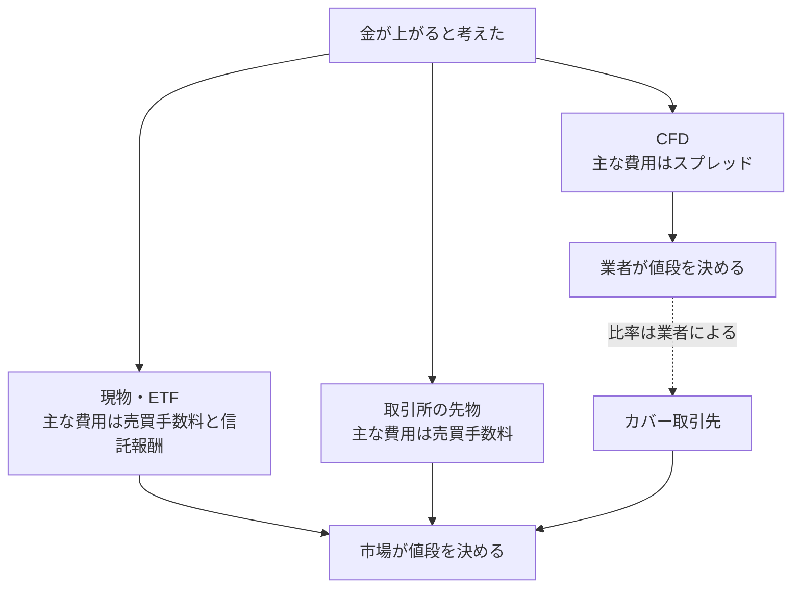

> [!NOTE]
> この記事は、track の表現力を検証する「track表現力ベンチ20260830」の一環としてAI生成したものです。

金が上がると考えたとします。
その見立てを利益に変える方法は一つではありません。
現物や ETF を買う、取引所の先物を建てる、CFD を建てる。
どれを選んでも損益の源は同じ金相場で、値段が動けば同じように損得が出ます。

違うのは、費用がどこに置かれているかと、値段を誰が決めているかです。



右端の分岐がこの記事の主題です。
現物も取引所の先物も、値段を決めるのは市場です。
CFD だけが、値段を提示する相手そのものと向かい合う形になります。
同じ[[原資産]]、同じ[[レバレッジ]]でも、業者によって往復の費用は変わりえます。

CFD (Contract For Difference) は商品の名前ではなく、契約の形の名前です。
原資産の受け渡しをせず、建てた値と決めた値の差額だけをやり取りする[[差金決済取引]]を指します。
その形の中で費用をどこに置くかは、値段を提示する側が決めています。
だから見るべきなのは原資産ではなく、相手のほうです。


## 相手は市場とは限らない

株を買うとき、注文は取引所に並びます。
値段を決めるのは市場で、証券会社は仲介料を取ります。

CFD はそうとは限りません。
国内で提供されている CFD の多くは[[店頭取引]]で、取引の相手方は業者自身です。
注文は取引所に出ていかず、値段は業者が提示します。

店頭であること自体が問題なのではありません。
国内の FX はほぼすべて店頭取引ですが、大手の[[スプレッド]]は極めて狭く、
[[取引所取引]]より安く済む場面もあります。
測るべきなのは、値段を提示する側の取り分がいくらかです。

見分ける手がかりは三つあります。

1. 契約書類に「相対取引」「店頭デリバティブ取引」の語があるか。
2. 「手数料は無料」と書かれているか。店頭取引では手数料を取る必要がありません。値段そのものに乗せられるからです。無料は安さの証拠ではなく、費用が別の場所にあるという合図になります。
3. [[限月]]があるか。取引所の先物には必ず期限があります。「期限なく保有できます」と書かれていたら店頭の商品である可能性が高いです。

業者は顧客と取った反対のポジションを、[[カバー取引]]として別の金融機関へ流すことがあります。
全部流せば業者の損益は主に提示スプレッドとカバー費用の差になり、流さなければ顧客の損益が業者の損益になります。
どちらの比率で運用しているかは、多くの場合開示されていません。

そして日本で CFD と呼ばれるものは、根拠法が二系統に分かれています。

| | 商品系 | 金融系 |
| --- | --- | --- |
| 対象 | 金、原油、農産物などの商品 | 株価指数、個別株、通貨 |
| 根拠法 | 商品先物取引法 | 金融商品取引法 |
| 所管 | 農林水産省、経済産業省 | 金融庁 |
| 自主規制団体 | 日本商品先物取引協会 | 金融先物取引業協会、日本証券業協会 |

同じ三文字でも、監督官庁も自主規制団体も別です。
業者がどちらの法令に基づいて営業しているかで、勧誘規制の適用範囲も変わります。


## 費用は価格表に載っていない

「手数料無料」と書かれていても、費用がないわけではありません。
実際の費用は数箇所に散っています。

| 費目 | いつ発生するか | 発生する条件 |
| --- | --- | --- |
| [[スプレッド]] | 建てた瞬間に含み損として | 常に |
| [[価格調整額]] | 限月交代のたび | 期限のある原資産を参照する銘柄 |
| [[オーバーナイト金利]] | [[建玉]]を持ち越すたび | 銘柄と業者による |
| 為替換算 | 円に直すたび | 外貨建て銘柄。益金と損金で適用レートが違うことがある |
| 強制決済による損失 | 保有期間の上限に達したとき | 上限を設けている業者 |

このうち建てた瞬間に確定するのはスプレッドです。
ただし「0.10 ドル」という表示だけでは、高いか安いかを判断できません。
判断できる形にするには、次の三つに直します。

以下は、実在の商品や業者を想定しない計算例です。
取引単位 1,000 単位、参照価格 100.00 ドル、為替 150 円、[[証拠金]]率 10% とすると、
想定元本は 1,500 万円、必要証拠金は 1,500,000 円になります。

```
往復費用   = スプレッド × 取引単位 × 為替
証拠金比   = 往復費用 ÷ 必要証拠金
必要変動幅 = スプレッド ÷ 参照価格
```

| スプレッド | 往復費用 | 証拠金比 | 必要変動幅 |
| ---: | ---: | ---: | ---: |
| 0.10 ドル | 15,000 円 | 1.0% | 0.10% |
| 1.00 ドル | 150,000 円 | 10.0% | 1.00% |

同じ原資産、同じレバレッジでも、スプレッドの違いは証拠金比で大きく表れます。
上の行でも建てた瞬間に証拠金の 1.0% を失い、下の行では 10.0% を失います。
相場観の優劣ではなく、口座を開く先を選んだ時点で決まる差です。


## レバレッジは費用も増幅する

レバレッジは値動きを増幅します。
証拠金比で見れば、スプレッドも同じ倍率で効きます。

値動きは確率的で、上にも下にも振れます。
スプレッドは確定で、建てた瞬間に一方向にしか動きません。
倍率が高いほど効きが読みにくくなるのは、後者のほうです。

表示の尺度も揃っていません。
レバレッジは証拠金に対する想定元本の倍率で示され、スプレッドは通常、価格の絶対幅で示されます。
表示尺度が違うため、スプレッドが証拠金に与える影響はそのままでは比較できません。

> [!NOTE]
> 証拠金比は建て方で動きます。必要証拠金ぴったりで建てれば 10.0% ですが、証拠金を 3 倍積めば約 3.3% です。
> 不変なのは価格に対する比率のほうです。ここでは必要証拠金ぴったりで建てる場合を基準に比較しています。

契約書面に証拠金比が示されていなければ、読む側が自分で割る必要があります。


## 業者の利害はどこにあるか

決算資料を公開している業者なら、三つの箇所を確認できます。

1. **営業収益の内訳。** 受取手数料とトレーディング損益の比です。ただし、トレーディング損益だけでは A ブックと B ブックの比率は判別できません。
2. **銘柄別の売買高。** 売買高に取引単位と平均スプレッドを掛けると、全額をカバーし、提示したスプレッドを収益化できた場合の上限を試算できます。実際の収益との差には、カバー費用、顧客同士の相殺、B ブックの損益などが含まれます。
3. **自己勘定の取引実績。** 業者自身が同じ相場を張っているかどうかです。

顧客取引を外部で全額カバーし、収益源がスプレッドに限られるなら、顧客の勝ち負けは業者の収益に直接は効きません。
[[AブックとBブック]]でいう A ブックに寄せているほど、この性質が強くなります。
方向では対立しませんが、頻度と量では対立します。
売買が増えるほど収益が増える構造だからです。

B ブック、つまりカバーせず自社で受ける比率が高い業者では、顧客の損失は業者の取引利益に、顧客の利益は業者の取引損失になります。
こちらは方向で対立します。

A ブックと B ブックに優劣の関係はありません。
一般に A ブックはスプレッドが広く、B ブックは狭くできるとされます。
問題は、目の前の業者がどちらに寄っているかが、開示からは多くの場合判別できないことです。

顧客側の成績を推し量れる統計も、系統によって異なります。
[金融先物取引業協会](https://www.ffaj.or.jp/library/performance/deposit/)は、店頭 FX について、口座別の実質損益に相当する預託金増減口座数割合を四半期ごとに公表しています。
[日本商品先物取引協会](https://www.nisshokyo.or.jp/app/public/cfd/summary/list)も店頭商品 CFD の口座数、証拠金等残高、取引金額、建玉残高を毎月公表していますが、口座別の増減割合は公表項目に含まれていません。


## 制度が用意している盾

[[不招請勧誘の禁止]]という規制があります。
[商品先物取引法 214 条 9 号](https://laws.e-gov.go.jp/law/325AC0000000239)と[施行令 30 条](https://laws.e-gov.go.jp/law/325CO0000000280)により、
個人を相手方とする店頭商品デリバティブ取引契約の勧誘は、要請がなければ禁止されています。
ただし、一定の継続的取引関係にある顧客のほか、ハイリスク取引の経験者や、年齢と保有金融資産などの条件を満たす顧客への勧誘にも例外があります。

要請の解釈は狭く、経済産業省と農林水産省は
「単に一般的な事項を照会することや、資料請求を行ったことのみをもって、
顧客から勧誘の招請があったとみなすことはできない」としています。
勧誘目的を明示しないセミナーでの勧誘も禁止です。

商品先物取引法では、取引所取引も、損失が取引証拠金を上回るおそれがあるものは不招請勧誘禁止の対象です。
対象外になるのは、初期投資額を超える損失が生じない損失限定取引などです。
対象外の商品を契約しただけでは、店頭商品 CFD を勧誘できる継続的取引関係にはなりません。
詳しい対象範囲と例外は、[日本商品先物取引協会の Q&A](https://www.nisshokyo.or.jp/investor/qa.html)で確認できます。

金融商品取引法系の店頭 CFD も、[金融商品取引法 38 条 4 号](https://laws.e-gov.go.jp/law/323AC0000000025)と[施行令 16 条の 4](https://laws.e-gov.go.jp/law/340CO0000000321)による不招請勧誘禁止の対象です。
一方、市場デリバティブ取引は同じ禁止の対象に含まれず、商品先物取引法とは範囲が異なります。


## CFD の利点

CFD には他の経路で代えにくい性質が四つあります。

- **売建てから入れます。** 現物では別の制度が要る場面でも、買いと同じ手順で建てられます。
- **単位が小さくて済みます。** 取引所の先物は 1 枚の想定元本が大きく、CFD には同じ原資産のミニ規格があることが多いです。
- **アクセス範囲が広いです。** 取引所に上場していない、あるいは日本から直接触れない原資産を扱えます。
- **ヘッジに使えます。** 現物ポジションの反対側を建てられます。

いずれも実在する利点です。
判断が分かれるのはこの利点が費用を上回るかどうかで、業者と銘柄ごとに変わります。
だから業者選びが相場観より先に来ます。
